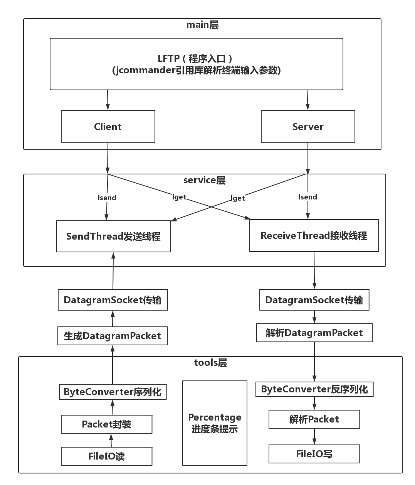
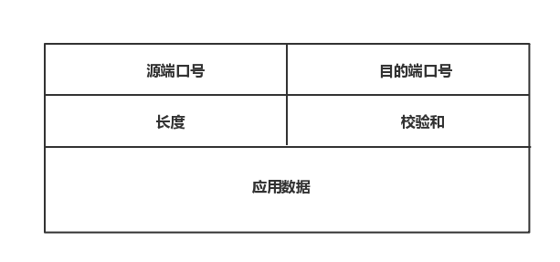
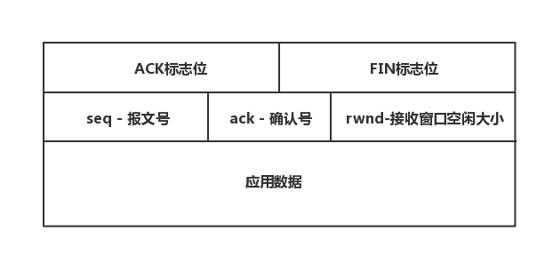
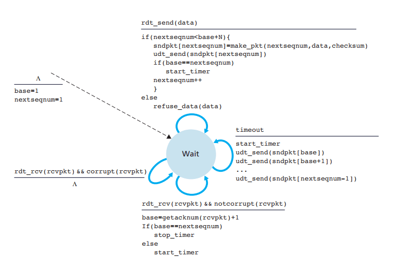
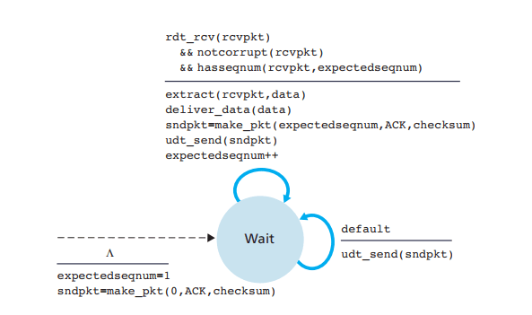
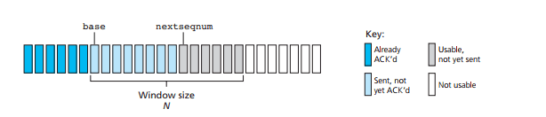
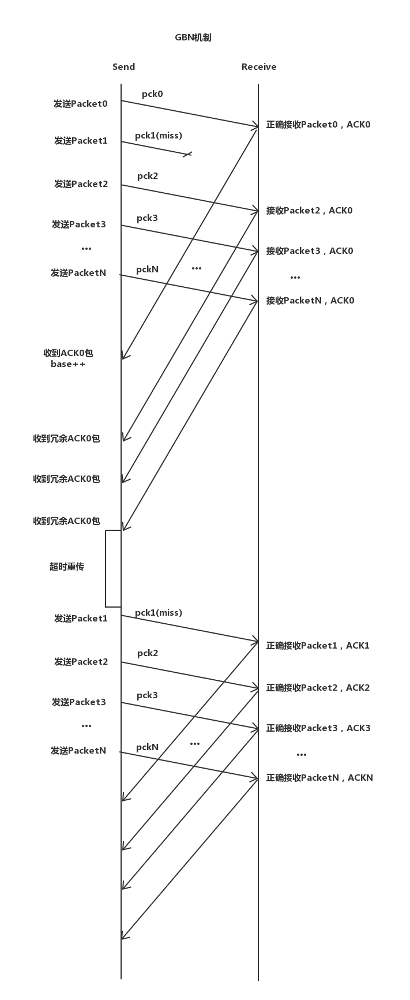
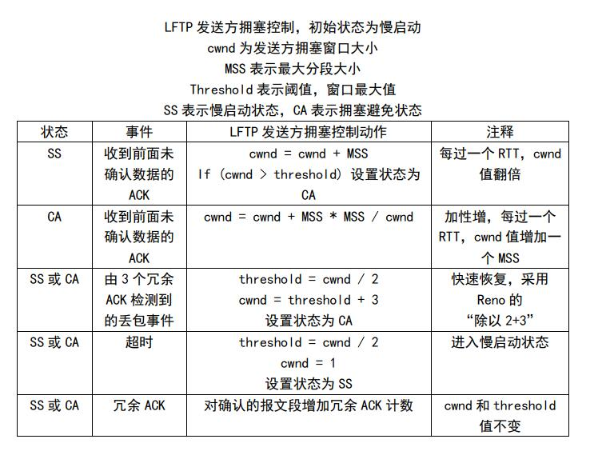

#  LFTP设计文档

Table of Contents
=================

* [LFTP设计文档](#lftp%E8%AE%BE%E8%AE%A1%E6%96%87%E6%A1%A3)
  * [项目简介](#%E9%A1%B9%E7%9B%AE%E7%AE%80%E4%BB%8B)
  * [实现内容](#%E5%AE%9E%E7%8E%B0%E5%86%85%E5%AE%B9)
  * [项目设计](#%E9%A1%B9%E7%9B%AE%E8%AE%BE%E8%AE%A1)
    * [项目结构](#%E9%A1%B9%E7%9B%AE%E7%BB%93%E6%9E%84)
    * [流程架构](#%E6%B5%81%E7%A8%8B%E6%9E%B6%E6%9E%84)
  * [实现机制](#%E5%AE%9E%E7%8E%B0%E6%9C%BA%E5%88%B6)
    * [封包类型](#%E5%B0%81%E5%8C%85%E7%B1%BB%E5%9E%8B)
    * [GBN协议](#gbn%E5%8D%8F%E8%AE%AE)
    * [流量控制](#%E6%B5%81%E9%87%8F%E6%8E%A7%E5%88%B6)
    * [拥塞控制](#%E6%8B%A5%E5%A1%9E%E6%8E%A7%E5%88%B6)
    * [超大文件传输](#%E8%B6%85%E5%A4%A7%E6%96%87%E4%BB%B6%E4%BC%A0%E8%BE%93)

Created by [gh-md-toc](https://github.com/ekalinin/github-markdown-toc.go)

***

## 项目简介

LFTP是一个java实现的网络应用，支持局域网、互联网上两台主机之间实现大文件传输。

***

## 实现内容

- 使用UDP协议进行传输
  - 基于 `Java` 的 `DatagramSocket,DatagramPacket`实现
- 实现100%可靠传输
  - 使用GBN协议回退N步保证所有报文正确接收
- 实现流量控制
  - 使用接收方通知发送方剩余接收缓存大小反馈发送方的发送窗口大小
- 实现拥塞控制
  - 使用动态的发送窗口，根据丢包、超时的网络状况调整发送窗口大小
- 使用客户端-服务器结构，服务器支持多个客户端并行服务
- 应用提供有意义的输出信息

***

## 项目设计

### 项目结构

```
./code/LFTP/src
├── main # 程序控制
│   ├── LFTP.java  # 主程序入口，解析命令行
│   ├── Client.java # Client客户端
│   └── Server.java # Server服务端
│
├── service # 文件收发服务
│   ├── SendThread.java # 文件发送服务线程
│   └── ReceiveThread.java # 文件接收服务线程
│
└── tools # 工具服务
    ├── FileIO.java # 文件读写IO管理
    ├── ByteConverter.java # 数据包序列化
    ├── Percentage.java # 进度条显示
    └── Packet.java # 数据包封装类
```

***

### 流程架构




应用由 `LFTP` 程序入口进入，解析终端输入的命令参数，根据不同的命令参数决定客户端/服务器的不同行为。

主要有两个核心模块：

**SendThread发送线程**

这个模块进行基于 `UDP` 的文件发送。

- 先从本地文件中分块读取数据进内存，一个区块 `10Mb` 。将块中数据的每 `1kb` 大小封装成一个  `Packet` 包，放入发送窗口中。
- 发送使用**流水线协议** （ `GBN`），通过 `GBM` 回退N步，来保证即使出现丢包、失序、超时都可以100%可靠传输。
- 使用 **流量控制服务** ，通过解析接收端返回的封装在 `Packet` 内的 `ACK` 包，得到 `Packet` 内的 `rwnd` 字段，得到接收端接收窗口的空闲空间大小，保证在接受端有空闲空间的时候才发送数据分组，从而控制发送端的发送流量。
- 使用 **拥塞控制服务** ，使用 TCP 拥塞控制的方法，维护发送窗口的大小和阈值。当收到3次冗余 ACK 包或者超时需要重传时，就减少发送窗口的大小，尽可能避免拥塞导致不断的丢包。

**ReceiveThread接收线程**

这个模块进行基于 `UDP` 的文件接收。

- 接收遵循 **流水线协议**（ `GBN` ），每当收到正确的下一个报文号的数据分组，发送确认号为这个报文号的ACK包给发送端。如果收到错误的，就发送上一次确认的报文号的ACK包给发送端。
- 使用 **流量控制服务** ，维护一个接收窗口，这里设置接收窗口大小为一个区块大小，也即10Mb。每次发送 `ACK` 包都将接收窗口剩余空间 `rwnd` 封装进 Packet 包中，通知发送方接受端的空闲缓冲大小。当接收窗口满了的时候，执行 `FileIO` 对文件进行写入，然后清空接收窗口继续接收数据分组。

***

## 实现机制

### 封包类型

- **UDP报文段**




- **Packet封装数据报文段**

  `data`数据是从文件 `FileIO` 读取出来的 `1kb` 的 `byte[]` 数据



***

### GBN协议

使用 **GBN** 回退N步的协议，实现UDP数据分组100%可靠传输。

我们按照书本**GBN** 协议拓展**FSM** 图的描述去实现（如下图所示）

稍有不同的是，我们的base是从0开始，也即我们的发送的数据分组的报文号是zero-base。

**发送端：** 



**接收端：** 



在 **GBN协议** 下，当收到正确的 ACK 的时候才会将报文从**发送中的数据队列**移除，发送窗口才会往右滑动，也即下图中的 base ++ 。在下一个超时时间之后会重新发送所有已发送但未确认的分组，也即下图中 `[base,nextseqnum)` 的分组。



具体的发送案例可以参见下图：

pck0正常接收，数据放入接收窗口缓存中，pck1丢失，接收端将不会将后续的pck2、pck3···放入接收窗口，返回的是错误的 ACK包，也即冗余的ACK0包。

接收端接收到正确的ACK0后，`base++`变成1。之后收到冗余的ACK0包，将不会将发送窗口右滑，直到下一次超时重传发生时，才重新将 `[1, N)` 的数据分组重传，也就是说，这时候丢失的pck1才得以重传，这样接收端能实现100%可靠的接收。




事实上，在后面**拥塞控制服务**的实现中，我们不必等待所有N-1个冗余ACK包抵达后超时才进行重传，在拥塞控制中，我们只要收到三个冗余的ACK包，我们就将修改发送窗口的大小和阈值，并重传未确认的分组。

***

### 流量控制

接收端维护一个接收窗口，并在返回的ACK包中返回一个指示 `rwnd` ——该接收窗口还有多少可用的空闲缓存空间。

当 `rwnd==0` 时，接收端将不再缓存新的数据包的分组数据，相当于丢弃这个包，而同时将接收窗口缓存满的数据写入文件中，写完后清空接收窗口缓存，并发送一个分组到发送端，告知发送端这里的接收窗口又有新的缓存空闲空间了，然后继续接收发送方传来的数据包。

而同时，发送端当收到 `rwnd==0` 的 ACK包，就会停止发送数据包，避免重复多次的冗余ACK和重传，直到收到接收端传来的通知窗口清空的信息分组，才继续进行数据发送。

然而需要注意的是，因为接收端发送的通知已清空缓存的信息分组可能会丢失，所以发送端有可能并不知道接收端何时有了新的接收窗口空闲空间，这样会导致接发两端都陷入阻塞。所以当 `rwnd==0`时，发送端依然要不停发送只有一个字节数据的报文段，相当于在不断的询问接收端是否已经清空缓存完毕，当收到回复 `rwnd>0` 后，发送端就可以继续传输数据包 。

这样就实现了 `流量控制服务` ，以消除发送方使接收方缓存溢出的可能性。

***

### 拥塞控制

拥塞控制服务我们使用的使 Reno 版 TCP拥塞控制的算法。

一共存在两个状态：

- SS 慢启动状态，发送窗口大小开始为1，然后以指数型增长到阈值。
- CA 拥塞避免状态，在阈值之后，以线性增长不断提速，直到丢包或超时事件的发生。
- 丢包事件：
  - 三个冗余ACK检测为丢包事件
  - 依照Reno TCP处理，阈值减半加三，当前窗口设为改后阈值+3
- 超时事件：
  - 阈值减半，窗口设为1，进入慢启动状态




### 超大文件传输


对于很大的文件，例如2Gb以上等大文件，我们不可能一次把文件全部读入内存，因此我们要分批次读取，所以设计了一个区块的概念。区块大小为10Mb，一次对文件的读写使10Mb。

因此我们在 `FileIO `中的读文件接口函数设置了一个参数——区块号，用以确认发送端想读出来的是哪一个区块的数据。

而为了让发送端知道有多少个区块，还有新加一个接口函数，`getBlockLength()`，用以知道文件总共有多少个区块。

如此，发送端就可以分批地一区块一区块的发送数据，应用运行就不会出现 `OutOfMemoryError` 使用内存溢出的情况。

***


 