# 测试文档

## 局域网测试

> 使用局域网测试时，我们通过开启wifi，两台主机在同一网络下进行通信

#### 服务端

**开启服务器**：

```bash
java -jar LFTP.jar server
```

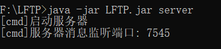

#### 客户端

**查看提示**：

```bash
java -jar LFTP.jar help
```

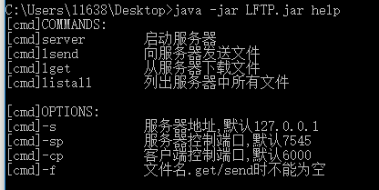

**查看服务器上的文件**：

```bash
java -jar LFTP.jar listall -s 172.18.33.245 -sp 7545
```

- 客户端输出：

  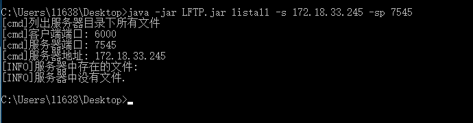

- 服务器端输出：

  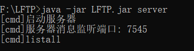

**一对一向服务器发送文件**：

```bash
java -jar LFTP.jar lsend -f test.mp4 -s 172.18.33.245 -sp 7545
```

- 客户端输出：

  

  可以看到，传输速度在经过慢启动阶段后逐渐增大，可以达到2Mb/s.

- 服务器端输出：

  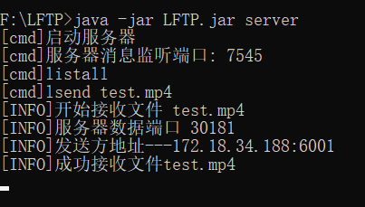

**多对一向服务器发送文件**：

必须指定新开客户端的控制端口-cp，否则造成端口冲突

同时，客户端可以选择不仅局限于当前路径下的文件来进行发送，比如`book/book.pdf`

```bash
java -jar LFTP.jar lsend -f book/book.pdf -s 172.18.33.245 -sp 7545
```

```bash
java -jar LFTP.jar lsend -f test.zip -s 172.18.33.245 -sp 7545
```

- 客户端并行发送中：

  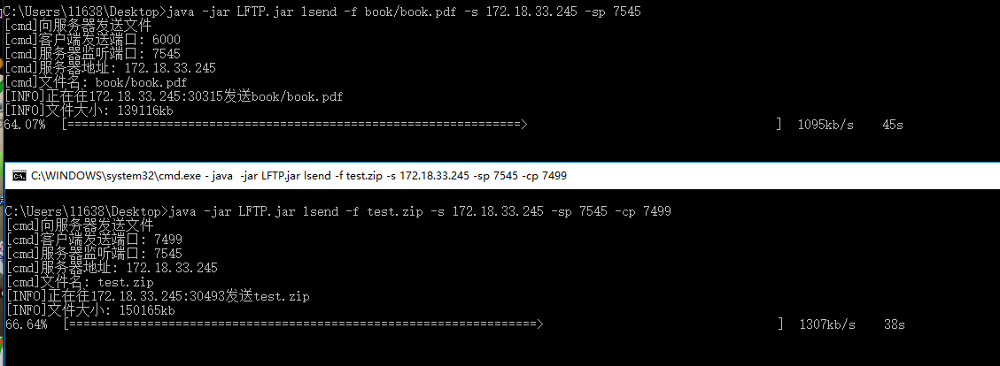

- 客户端并行发送完成：

  

  **可以从这里看出拥塞控制的作用，并行发送时，两个客户端可以共享带宽，传输速度各接近于单对一发送时的一半**

- 服务器端并行发送开始：

  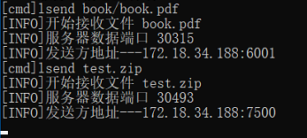

- 服务器端并行发送完成：

  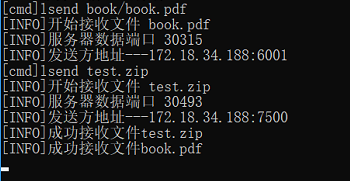

- 服务器端查看文件结构：

  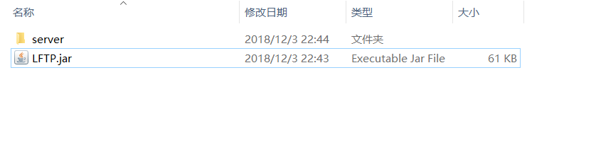

  

- 服务器端解压接收压缩文件：

  

  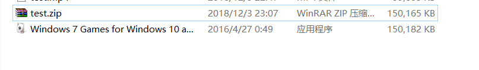

  可以看到，解压成功，因此文件传输没有问题

**再次listall查看服务器中文件**

```bash
java -jar LFTP.jar listall -s 172.18.33.245 -sp 7545
```

- 客户端输出：

  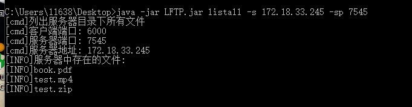

- 服务器端输出：

  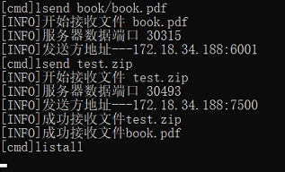

准备测试lget时，两台主机之间的连接出现了问题，我们交换了两台主机的角色，并在新的服务器主机上添加了前面传输的3个文件，可以认为只是服务器地址变了

**多对一从服务器下载文件**

同样，必须使用-cp来给不同的客户端指定不同的控制端口

```bash
java -jar LFTP.jar lget -f book.pdf -s 192.168.137.42 -cp 3999
```

```bash
java -jar LFTP.jar lget -f test.zip -s 192.168.137.42 -cp 3999
```

- 客户端多对一lget开始:

  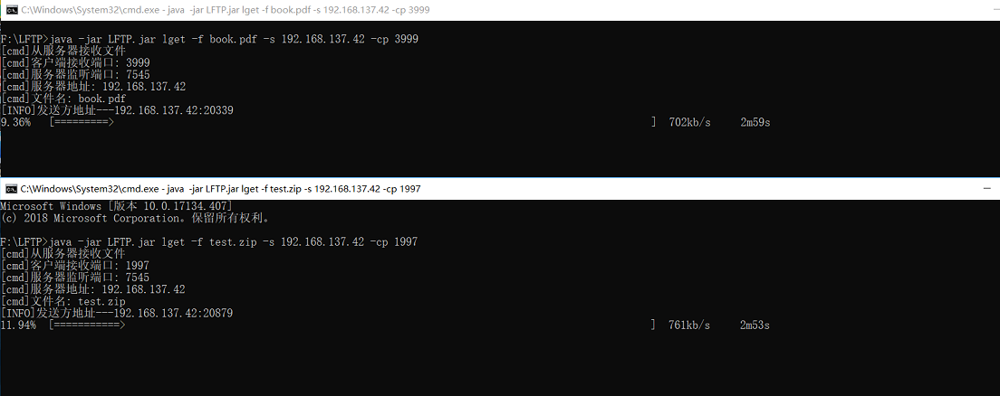

- 客户端多对一lget结束:

  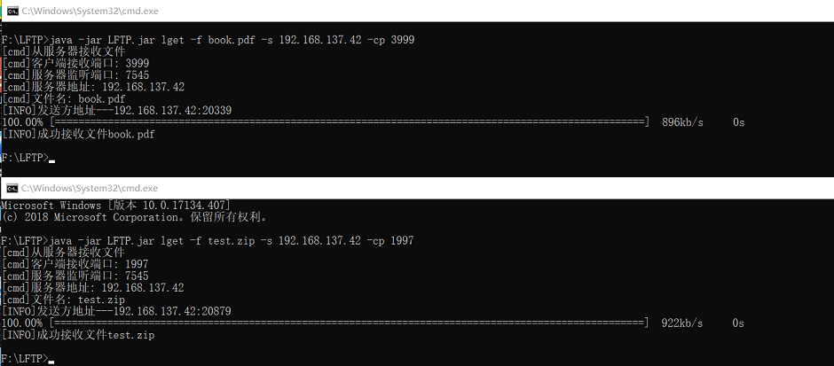

  **同样，在下载文件时也可以看到拥塞控制的作用，两个客户端的速度被控制到几乎相同**

- 服务器端输出：

  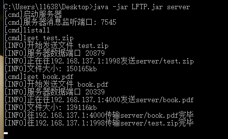

- 客户端lget结束后文件结构:

  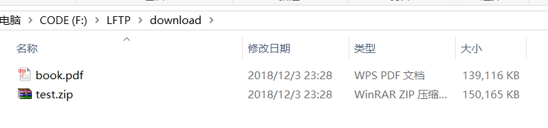

- 客户端解压下载的文件:

  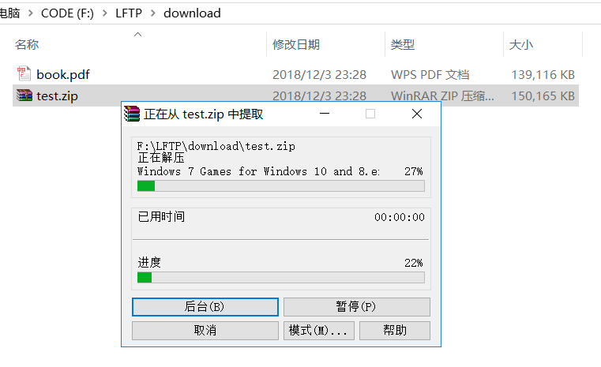

  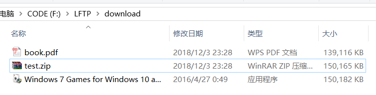

  **可以看到解压成功，因此下载文件没有问题**

**测试大文件传输**

我们在局域网下进行了大文件的传输测试，`bigFile.zip`文件大小为2.7GB

```bash
java -jar LFTP.jar lsend -f bigFile.zip -s 192.168.137.42 -sp 7545
```

- 客户端发送超大文件开始:

  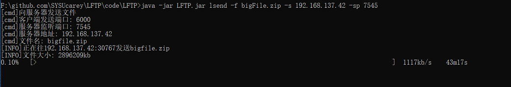

- 查看发送超大文件时占用的内存：

  

  **可以看到，在发送超过2GB的大文件时，客户端占用的内存也只有100多M，没有把整个文件都读入内存中，对文件的分块传输设计成功**

- 客户端发送超大文件完成：

  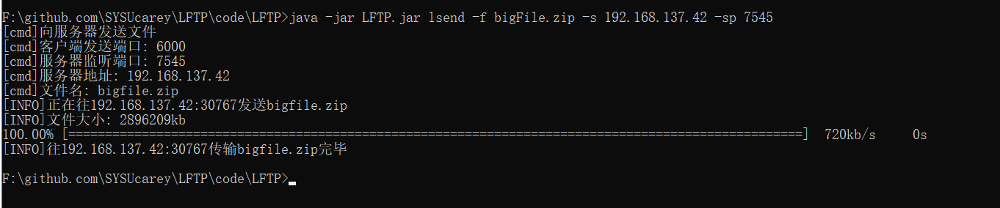

  由于中途网络断开了，因此这里显示的传输平均速度只有700kb/s，但实际速度依然是有2Mb/s的

- 服务器端接收大文件成功：

  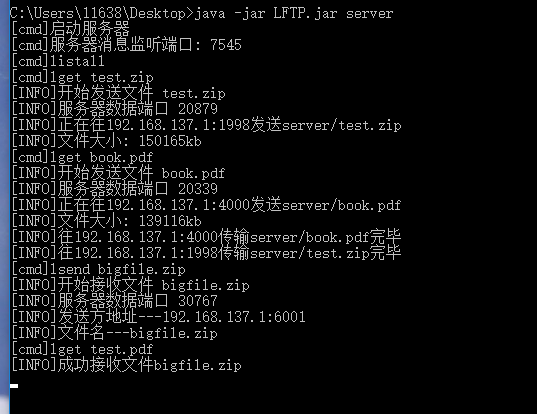

****

## 互联网测试

> 服务器：腾讯云
> 系统：Windows Sever
> 运行环境：Java JDK11
> 服务器地址：119.29.204.215(广州公网IP地址)

注意，在服务器上进行测试时，要把我们需要使用的服务器的端口的防火墙打开，否则无法访问

#### 服务端

**开启服务器**：

默认的端口是7545


#### 客户端

**多对一向服务器发送文件**：

注意要设置客户端控制端口的不同

```bash
java -jar LFTP.jar lsend -f jay.mp3 -s 119.29.204.215 -sp 7545
```

```bash
java -jar LFTP.jar lsend -f ppt.zip -s 119.29.204.215 -sp 7545 -cp 20500
```

可以看到服务器为我们打开的数据端口30306和30700，需要提前打开服务器防火墙中的这两个端口

- 服务器端输出：

  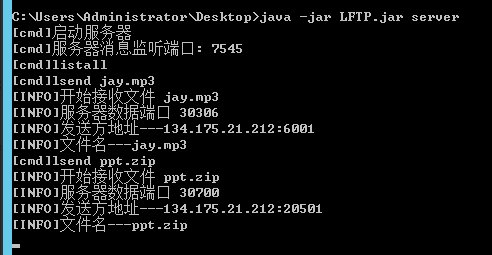

- 客户端输出：

  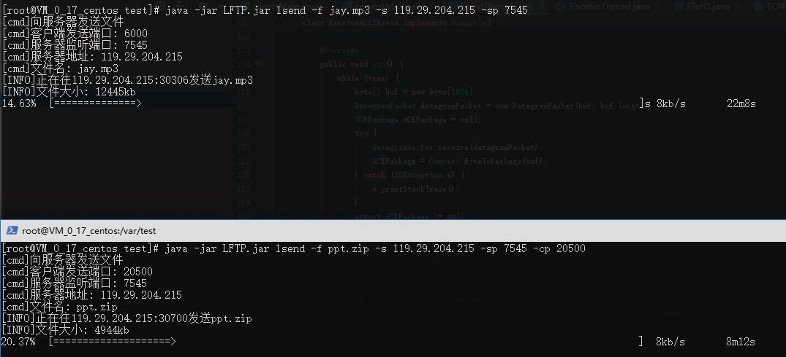

  由于服务器的带宽限制和处理器限制，速度很慢，在存在拥塞控制的情况下，每个客户端的速度只有10kb/s

**列出服务器上的文件**

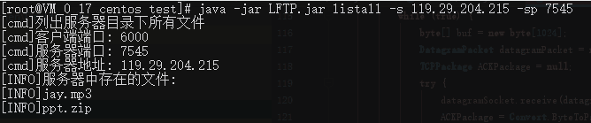

可以看到，服务器中存在我们刚刚发送的两个文件

**多对一从服务器下载文件**

在这里，同样要注意设置客户端的控制端口不同

```bash
java -jar LFTP.jar lget -f jay.mp3 -s 119.29.204.21 -sp 7545
```

```bash
java -jar LFTP.jar lget -f ppt.zip -s 119.29.204.21 -sp 7545 -cp 20000
```

在输出中，我们可以看到服务器为我们打开的数据端口20230和20795，需要打开服务器防火墙的这两个端口

- 服务器端输出：

  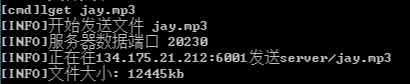

  

- 服务器端发送成功的输出：

  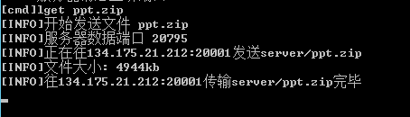

- 客户端接收成功后输出：

  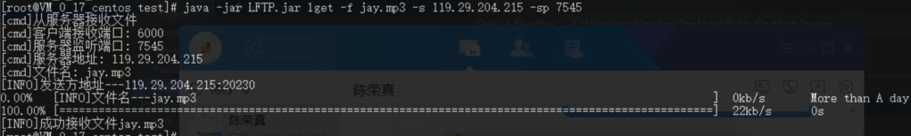

  

  在这里，因为与服务器的连接比较慢，我们又是通过线程来处理输出，因此显示的提示信息有些乱，但还是可以看到文件传输成功的

#### 检验文件

**查看文件哈希值**

最后，我们分别在两端查看文件的哈希值，来证明文件传输是没有问题的：

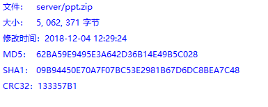

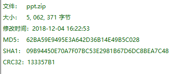

可以看到，文件的大小和内容是完全一样的，因此实现了100%可靠的传输。